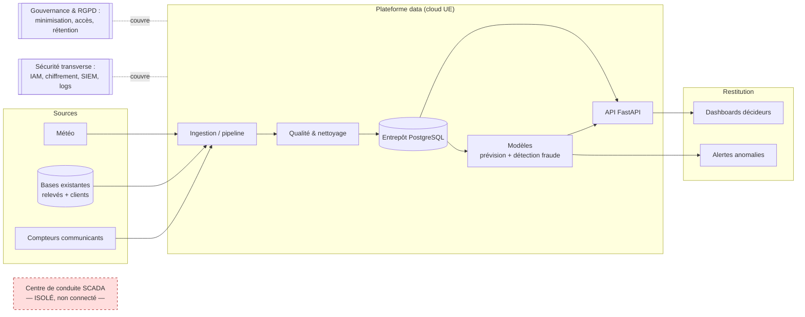

# Note de cadrage — Programme Néovolt Grid+

**Projet :** Néovolt Grid+ — modernisation de l'exploitation des données du réseau de distribution
**Commanditaire :** Direction des Systèmes d'Information (DSI) de Néovolt — sponsor
**Équipe :** équipe projet pluridisciplinaire missionnée (ESIS / CPDIA)
**Nature de la mission :** cadrage + prototypage, sprint de 5 jours (1ᵉʳ → 5 juin 2026)
**Version :** v1 (J1) — document vivant, mis à jour au fil du sprint

---

## 1. Reformulation du besoin

Néovolt distribue électricité et gaz à ~600 000 points de livraison sur un territoire mixte.
Depuis deux ans, le déploiement de **compteurs communicants** (91 % du parc dans notre
échantillon) génère une masse de relevés **aujourd'hui sous-exploitée** : données dispersées
dans des bases en silos, qualité non maîtrisée, analyses faites à la main dans des fichiers
Excel personnels, aucun traitement en flux, aucune gouvernance, sécurité jamais auditée.

En tant qu'**opérateur d'infrastructure critique**, Néovolt ne peut pas traiter ces sujets
comme un projet IT ordinaire : une mauvaise anticipation des pics coûte cher (achats
d'énergie d'équilibrage), une fraude non détectée représente une perte sèche, et une faille
de sécurité menace la continuité d'un service essentiel et la conformité (RGPD, NIS 2).

**Le besoin reformulé :** doter Néovolt d'une **première brique de plateforme data** capable de
(1) **fiabiliser** les relevés, (2) **anticiper** la demande, (3) **détecter tôt** les anomalies et
fraudes, (4) **restituer** aux décideurs des tableaux de bord clairs, le tout **sécurisé,
conforme et piloté** — et de démontrer, par un prototype, que la chaîne est crédible avant
d'engager l'industrialisation.

---

## 2. Objectifs mesurables

| Objectif | Indicateur cible | Aligné sur |
|---|---|---|
| Fiabiliser les données | Pipeline de qualité corrigeant 100 % des doublons et signalant les aberrants ; fraîcheur **J+1** | SLA Néovolt |
| Anticiper la demande | Modèle de prévision conso, erreur **MAPE < 15 %** à l'horizon retenu | Achat d'énergie |
| Détecter les anomalies | Détection d'une anomalie majeure **< 7 jours** (vs plusieurs mois) ; rappel mesuré sur les 24 fraudes confirmées | SLA + ROI |
| Outiller les décideurs | **3 tableaux de bord** ciblés (exploitation réseau, finance, relation client) | Besoin métier |
| Sécuriser & se conformer | Analyse de risque + détection sur journaux + **AIPD** fraude ; notif incident **< 24 h** | RGPD / NIS 2 / ISO 27001 |
| Piloter | Business case dans l'enveloppe **450 k€** + gouvernance (RACI) + plan de conduite du changement | Cadrage DSI |

---

## 3. Périmètre retenu

**Dans le périmètre (prototype traité sérieusement) :**
- 2 cas d'usage cœur : **détection d'anomalies/fraude** et **prévision de consommation**.
- Une **chaîne de données** complète mais légère : ingestion des CSV → nettoyage/qualité →
  stockage relationnel → exposition par **API** → restitution **dashboards**.
- Les **dimensions transverses** (sécurité, RGPD/éthique, gouvernance, Green IT, valeur métier).
- Le **cadrage projet** (chiffrage, planning, risques, conduite du changement).

**Hors périmètre (assumé, à traiter au niveau conception uniquement) :**
- Mise en production réelle, intégration directe au **SCADA** (isolé, on ne s'y connecte pas).
- Traitement temps réel à l'échelle des 600 000 PDL (le prototype travaille sur l'échantillon
  de 700 PDL ; l'architecture est **pensée pour le passage à l'échelle**).
- Remplacement des bases existantes (logique de **coexistence**, pas de table rase).

---

## 4. Hypothèses explicites

1. L'échantillon de **700 PDL sur 2 ans** est représentatif du parc (extrapolation documentée pour le ROI).
2. Le **taux de fraude observé de 3,43 %** (24/700) est une borne basse (seules les fraudes *confirmées* sont fournies ; les non détectées gonflent le gisement réel).
3. Les coûts unitaires de cadrage fournis (JH 550/750/900 €, cloud 3 500 €/mois, etc.) sont retenus comme **hypothèses de chiffrage**.
4. Hébergement **cloud UE** (souveraineté) ; pas d'enfermement fournisseur (réversibilité via formats ouverts + conteneurs).
5. Les relevés négatifs/nuls/aberrants relèvent de défauts capteurs ou d'erreurs de collecte (pas d'injection malveillante à ce stade) — à confirmer côté sécurité.

---

## 5. Contraintes structurantes

- **Techniques :** coexistence avec l'existant ; **isolement du SCADA** ; volumétrie (archi *scalable*) ; **souveraineté UE** des données conso ; **réversibilité** (pas de lock-in).
- **Réglementaires :** **RGPD** (base légale, minimisation, durée de conservation, droits ; **AIPD obligatoire pour la détection de fraude**) ; **NIS 2** (sécurité renforcée, notification < 24 h) ; **ISO 27001** (bonnes pratiques SMSI) ; **décision automatisée explicable + humain dans la boucle** (pas d'accusation de fraude 100 % automatique).
- **Budgétaires :** enveloppe **450 000 €** pour la phase 1 (cadrage + industrialisation + 1ʳᵉ mise en service), hors exploitation courante.
- **Niveaux de service cibles :** dispo plateforme **99,5 %**, fraîcheur conso **J+1**, détection anomalie majeure **< 7 j**, notification incident sécurité **< 24 h**.

---

## 6. Diagnostic des données (synthèse — détail dans `diagnostic-qualite-donnees.md`)

10 jeux de données, dont le cœur : **512 986 relevés** quotidiens, **700 PDL**, **8 zones**, du 01/01/2024 au 31/12/2025.

**Problèmes de qualité identifiés (à traiter — c'est un livrable, pas un détail) :**
- **1 286 doublons** (id_pdl, date) → complétude apparente de 100,3 % (>100 % = signal de doublons).
- **1 034 valeurs négatives** et **639 valeurs nulles** de consommation (capteurs / collecte).
- **6 856 relevés manquants** (1,3 %).
- Valeurs **aberrantes** : max à 20 767 kWh/jour ; ~9 % des relevés au-dessus du seuil Q3+3·IQR.
- `nb_personnes_foyer` **manquant à 39 %** dans `clients.csv`.

**Signaux métier exploitables :**
- **Fraude :** 24 cas confirmés — *sous-comptage* (14), *branchement illicite* (6), *compteur trafiqué* (4) → **taux 3,43 %**, base du chiffrage ROI.
- **Réclamations :** 3 000 textes ; satisfaction **majoritairement basse** (≈84 % de notes ≤ 3) ; **701 mentionnent une « coupure »**, **189 évoquent les données/RGPD** → matière pour le NLP, la relation client et l'éthique.
- **Incidents réseau :** 420 incidents, **209 120 PDL·incidents** cumulés, causes dominantes *vétusté* et *intempéries* → coût à chiffrer.
- **Sécurité (journaux mars→mai 2026) :** 47 824 événements, **8,2 % d'échecs** ; anomalie forte : **14 utilisateurs mais 3 290 IP sources distinctes**, et l'IP externe **203.0.113.45 cumule 47 échecs de connexion** (signature de *brute force*). 1 436 `export_donnees`, 973 `modification_config`.
- **Actifs SI :** 28 actifs, **8 critiques**, **13 portant des données sensibles**, 6 exposés (internet/DMZ).

---

## 7. Architecture cible (vue d'ensemble)

> Le **SCADA reste isolé** : la plateforme ne s'y connecte pas directement. Coexistence avec
> les bases existantes (intégration, pas remplacement). Détail technique dans
> `docs/01-architecture-cible.md` (à venir).

---

## 8. Organisation, rôles et planning du sprint

**Rôles par volet** (selon spécialités présentes dans le groupe) :
- **Chef de projet (CPID)** — cadrage, business case, RACI, conduite du changement, pilotage.
- **Data Analyst** — qualité, EDA, segmentation, séries temporelles, NLP réclamations, dashboards.
- **Data Scientist** — prévision conso, détection fraude/anomalies, MLOps, évaluation critique.
- **Ingénierie Logiciel & Data Eng (ILD)** — architecture, pipeline, API, conteneurisation, intégration.
- **Cybersécurité (CIC)** — analyse de risque, audit, SIEM, runbook, conformité.

**Jalons du sprint :**

| Jour | Objectif | Livrable de fin de journée |
|---|---|---|
| **J1 — Lun 01/06** | Cadrage & conception | **Cette note de cadrage** + diagnostic qualité + backlog + repo |
| **J2 — Mar 02/06** | Conception détaillée + démarrage prod | Environnements en place, pipeline + nettoyage amorcés |
| **J3 — Mer 03/06** | Production au cœur | Modèles, dashboards, API, analyse sécurité |
| **J4 — Jeu 04/06** | Intégration & consolidation | Assemblage testé, dossier + exec summary EN rédigés |
| **J5 — Ven 05/06** | Finalisation & dépôt | Vidéos (démo + soutenance), slides, dépôt avant 23h59 |

Suivi : **tableau Kanban** + dépôt Git avec **commits nominatifs** (traçabilité = note individuelle).

---

## 9. Risques principaux & mitigation

| # | Risque | Prob. | Impact | Mitigation |
|---|---|---|---|---|
| R1 | Périmètre trop large pour 5 jours | Élevée | Élevé | Focus 2 cas d'usage ; reste en conception |
| R2 | Qualité des données bloque les modèles | Élevée | Élevé | Pipeline qualité dès J2 ; règles documentées |
| R3 | Modèle de fraude biaisé / injuste (faux positifs) | Moyenne | Élevé | Humain dans la boucle, AIPD, métriques par segment |
| R4 | Intégration de dernière minute qui échoue | Moyenne | Élevé | Intégration continue dès J3, interfaces (API) figées tôt |
| R5 | Dépassement budgétaire dans le business case | Moyenne | Moyen | Chiffrage par lots, arbitrages priorisés valeur/risque |
| R6 | Membre peu contributif → note individuelle | Moyenne | Moyen | Journal de bord quotidien, commits nominatifs, oral partagé |

---

## 10. Dimensions transverses (intégrées, pas juxtaposées)

- **Éthique & RGPD :** minimisation (n'exploiter que le nécessaire), **AIPD** pour la fraude, transparence des décisions, **humain dans la boucle** ; vigilance sur le biais (un modèle ne doit pas sur-cibler un segment de clients).
- **Sécurité dès la conception :** chiffrement des données sensibles, IAM (revue des comptes prestataires à droits élevés signalés dans le SI), journalisation/SIEM, isolation du SCADA.
- **Gouvernance des données :** propriété (qui possède quoi), qualité, cycle de vie, droits d'accès, durées de conservation.
- **Green IT :** sobriété des traitements (échantillon avant volume, pas de deep learning gratuit), arbitrages stockage/calcul raisonnés.
- **Valeur métier :** chaque brique sert un décideur identifié (exploitation, finance, relation client) ; ROI explicité.
- **Innovation :** piste d'ouverture (ex. assistant IA expliquant une anomalie en langage naturel) argumentée pour la suite.

---

## 11. Critères de succès (point de vue Néovolt)

Une réponse réussie : **répond à un vrai besoin**, **repose sur les données fournies**, **assume
ses hypothèses et limites**, **intègre sécurité et conformité dès la conception**, et **se présente
de façon compréhensible par des décideurs non techniques**.

---

*Document produit avec l'assistance d'un agent IA (Claude), relu et assumé par l'équipe.
Chaque choix est défendable en soutenance.*
