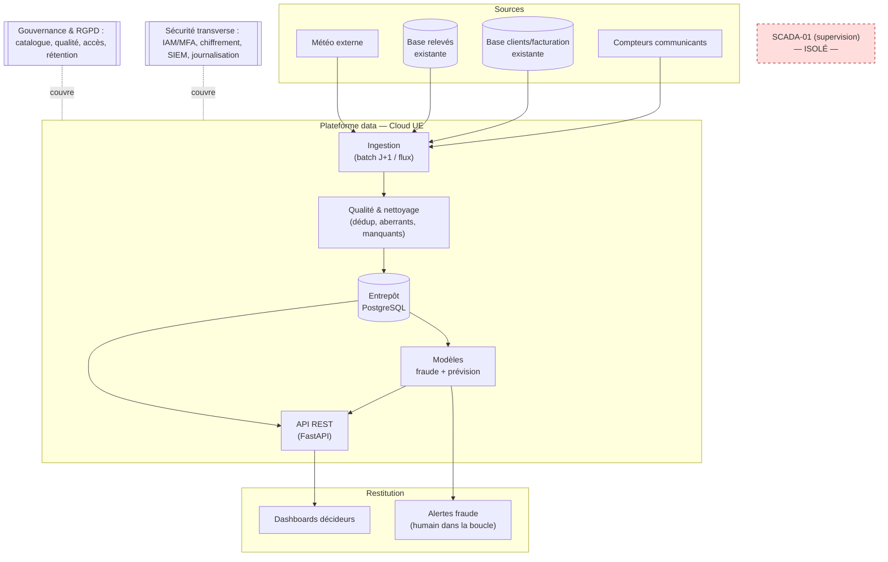

# Architecture cible — Néovolt Grid+

Du prototype (qui tourne) à la cible industrialisable. Principe directeur : **un prototype
modeste mais réel aujourd'hui, une trajectoire crédible vers l'échelle demain.**

## 1. Principes directeurs
| Principe | Traduction concrète |
|---|---|
| **Coexistence** (pas de table rase) | On lit les bases existantes (relevés, clients) ; on ne les remplace pas |
| **SCADA isolé** | Aucune connexion directe à SCADA-01 ; la plateforme vit dans un autre domaine |
| **Souveraineté** | Données de consommation hébergées dans l'UE |
| **Réversibilité** | Formats ouverts (CSV/Parquet), conteneurs, SQL standard → pas de lock-in |
| **Scalabilité** | Prototype sur 700 PDL, architecture pensée pour 600 000 |
| **Sécurité & RGPD by design** | IAM, chiffrement, journalisation, minimisation dès la conception |
| **Sobriété (Green IT)** | Échantillon avant volume, batch avant streaming, pas de deep learning gratuit |

## 2. Vue logique (couches)

## 3. Vue de déploiement : prototype vs cible
| Brique | Prototype (livré, testé) | Cible (industrialisation) | Pourquoi |
|---|---|---|---|
| Ingestion | Script Python (batch CSV) | **Kafka** (flux compteurs) + **Airflow** (orchestration batch) | Volumétrie, fraîcheur J+1, temps réel |
| Qualité | `scripts/02_nettoyage.py` | Mêmes règles, exécutées dans Airflow + Great Expectations | Reproductible, monitoré |
| Stockage | **SQLite** (fichier) | **PostgreSQL** managé UE (+ stockage objet pour data lake) | Concurrence, volume, souveraineté |
| Modèles | scikit-learn + joblib | + **MLflow** (suivi/registry), ré-entraînement planifié | MLOps, surveillance de dérive |
| API | **FastAPI** + Docker | FastAPI + **Kubernetes** (réplicas, autoscaling) | HA 99,5 %, montée en charge |
| Restitution | **Plotly** (HTML) + Power BI | Power BI / dashboards temps réel | Adoption décideurs |
| Sécurité | non-root, secrets hors repo, pip-audit | **MFA**, **SIEM** (Elastic), TLS, Vault, scan d'image | NIS 2, défense en profondeur |

## 4. Flux & fraîcheur
- **Batch J+1** des relevés (cible SLA) : ingestion nocturne → qualité → entrepôt → dashboards le matin.
- **Détection de fraude** : scoring périodique (hebdomadaire) → file d'alertes → **enquête humaine**.
- **Prévision** : ré-entraînement régulier, prévision glissante pour l'achat d'énergie.

## 5. Passage à l'échelle (700 → 600 000 PDL)
- **Partitionnement** des relevés par date/zone ; index sur (id_pdl, date) — déjà en place.
- **Découplage** ingestion / calcul / API (chacun scalable indépendamment).
- Calcul des features de fraude **incrémental** (par lot de PDL) plutôt que tout en mémoire.
- Estimation de stockage : ~600 000 PDL × 48 relevés/j ≈ **29 M points/jour** → dimensionner
  l'entrepôt + politique de rétention (36 mois puis agrégation, cf. gouvernance).

## 6. Haute disponibilité & résilience (cible 99,5 %)
- Réplicas API (Kubernetes), base managée avec réplication + sauvegardes **testées hors-ligne**.
- Dégradation maîtrisée : si l'ingestion flux tombe, bascule sur batch ; si la passerelle de
  télérelève est indisponible, relevé manuel de secours.
- **Isolation du SCADA** garantie par segmentation réseau : un incident plateforme n'atteint
  pas la supervision du réseau électrique.

## 7. Sécurité en profondeur (résumé — détail volet Cyber)
Périmètre exposé durci (MFA, WAF), réseau segmenté (SCADA isolé, DMZ), données chiffrées
(transit + repos), accès au moindre privilège + journalisation → **SIEM** avec les 6 règles
de détection, runbook de réponse (NIS 2 < 24 h).
